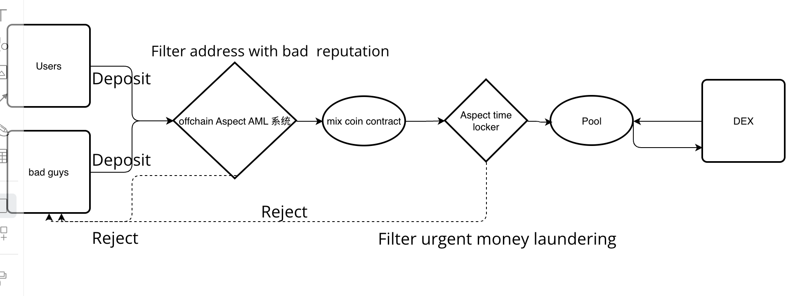

## Use Case Summary
Industry Pain Points: Nocturne faces issues related to involvement in illegal activities, such as organized crime and terrorism financing, which are also concerns for other DApps. However, it's impractical for each DApp to individually establish such systems. Aspect can provide a unified solution.

## Current Approach:
To use addresses associated with this protocol, users must apply to Nocturne's off-chain AML system. Upon approval, Nocturne adds the address to the whitelist on-chain. Future plans include optimizing for an on-chain solution. 

## Team Members
Team Member 1: Bill - Contract and Backend Development

Team Member 2: Yasige - Frontend Development

Team Member 3: D - Product and Test Development

Team Member 4: Qiuqiu - Content

## Problem Addressed
Anonymous transactions can easily be exploited for illicit activities like money laundering. For instance, "Tornado Cash" faced severe consequences, including the loss of its founders. Nocturne aims to provide anonymous transaction functionality to legitimate users while preventing exploitation by criminal elements.

Thus, to interact with this protocol, addresses must be authenticated through their off-chain AML system.

## Project Design

Aspect's Entry Points:

Entry Point 1

Entry Point 1: Generalizing the Nocturne Model as a Service (Off-chain AML System + On-chain Aspect):
Making the Nocturne model a universal service eliminates the need for other protocols to:
1) Implement their off-chain AML.
2) Modify application contracts to add whitelist logic.

Step 1: Addresses submit applications to Aspect for AML approval. The off-chain AML system monitors this and calls Aspect to whitelist the address.
Step 2: Contracts requiring AML verification bind to Aspect. When an address calls these contracts, Aspect intercepts and checks if they pass AML.

Entry Point 2:
Off-chain AML Scoring System + On-chain Aspect Score + On-chain Aspect Integration System

Step 1: The off-chain AML scoring system analyzes address AML scores offline, ranging from 0 to 10. Higher scores indicate higher risks of money laundering or terrorism financing.
Step 2: The AML system periodically synchronizes address scores with on-chain Aspect.
Step 3: On-chain contracts bind to Aspect and configure the minimum score required for address interaction, reducing the risk of applications being used for illicit purposes.

This is a hot project in the Ethereum ecosystem, introducing AML.

Understanding their approach and points can lead to excellent alignment and real-world demand fulfillment. In the demo implementation, focus on key Aspect processes: score/whitelist updates, dynamic DApp integration, and real-time on-chain verification. Detailed implementation of AML whitelist logic and scoring may not be necessary, as they are established processes. Demonstrating Aspect's application suffices.

## Value to the Artela Ecosystem

We understand that the outcome of projects like "Tornado Cash" involving anonymous transactions was highly unfavorable. However, anonymous transactions do provide a certain level of user privacy protection within limits. We shouldn't stifle the development potential of this capability. Therefore, what improvements can we make? Additionally, the ongoing regulatory friction between Web3 DeFi and traditional financial systems poses a challenge to the further marketization of DeFi.

By leveraging Aspect's jump points and the speed of WebAssembly (WASM), we aim to develop a real-time AML system. This system will bridge the gap between off-chain and on-chain data, maximizing the reduction of money laundering and malicious activities while preserving user privacy. By achieving this, we can gain trust from users and stakeholders, facilitating the further marketization of DeFi.

## How to use（in the demo part）
The user connects their wallet, selects the amount of tokens to deposit, and then initiates a deposit request, which activates the Aspect AML system for inspection. If the AML system's inspection passes, the user's deposit can be stored in the contract. That means user pass Aspect AML System. The deposited tokens can be withdrawn at any time.

